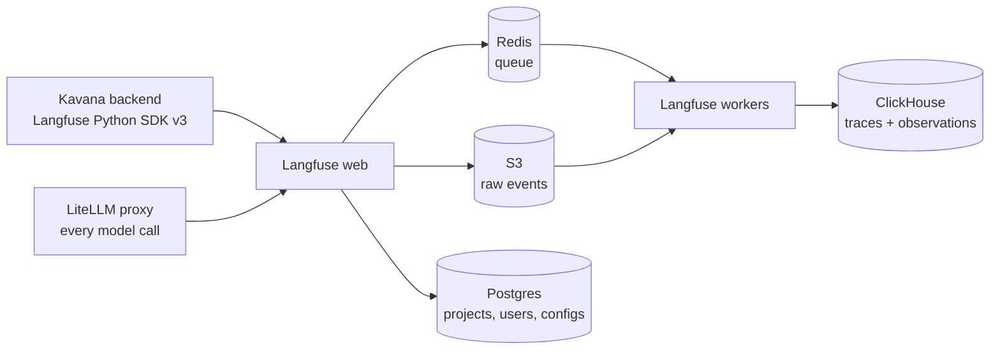

# AI Observability from First Principles

Most teams add observability the way they add insurance. Late, reluctantly, and after something burned.

I spent the last year running Langfuse for Kavana, a consumer AI companion app. Three million traces a day. Twenty million observations. One self-hosted stack, one small team. This is what I would tell myself at the start.

## Start with the question, not the tool

Observability is not dashboards. It is the ability to answer a question you did not know you would ask.

A traditional service has a small set of questions. Is it up. Is it slow. Is it erroring. The answers are numbers, and numbers aggregate well.

An LLM product has a different shape. The system can be up, fast, and error-free while being wrong. The failure is in the content. "Why did the character break persona on turn forty" is not a metric. It is a story, and you need the whole story to answer it.

So the first principle: for LLM systems, the unit of observation is the trace, not the metric. A trace is the full record of one user turn. What came in. What context was built. What the model saw. What it said. What it cost.

Everything else is derived from that.

## When you actually need it

Not on day one. Day one you need ten users and a chat log.

You need it the moment you can no longer read every conversation. For a consumer app that happens fast. Kavana crossed that line within weeks.

After that point there are exactly three things observability is for.

**Debugging.** A user reports something strange. You need to find their turn, see the exact prompt, and replay it. Without a trace you are guessing. With one you are reading.

**Cost.** Tokens are the bill. If you cannot attribute cost to a user, a bot, or a feature, you cannot make a single pricing decision with confidence.

**Quality.** You changed the prompt. Did it get better. You will not know from vibes. You need a judge that reads every window, applies the same rubric, and writes down a verdict.

If a feature of your observability stack does not serve one of those three, it is decoration.

## The shape of consumer scale

Consumer scale is not big enterprise scale. It is different.

Enterprise traffic is bursty and low volume. Consumer traffic is flat and relentless. Kavana's overnight floor is around thirty thousand traces an hour. It never goes to zero. Peak is about two hundred thousand an hour, and every one of those traces has roughly seven child observations.

That volume changes what you can afford to do. You cannot sample at the start and figure it out later. You decide early: trace everything, or trace a fraction. We traced everything. Every websocket turn, every user. No sampling.

That was the right call, and it was expensive. The rest of this post is about paying for it well.

## Running Langfuse yourself

Langfuse is open source and self-hostable. At our volume, self-hosting was not optional. The cloud tier would have cost a multiple of the infrastructure.

Here is the architecture that stabilized.

Two things worth knowing about this picture.

First, the write path is durable before it is queryable. The web tier writes each event batch to S3 and enqueues a pointer in Redis. Workers drain the queue into ClickHouse. If ClickHouse restarts, ingestion keeps accepting. The UI goes dark for two minutes and nothing is lost. That property saved us more than once.

Second, ClickHouse is the whole game. Everything else is stateless or small. Postgres was under ten gigabytes after months. Redis held a hundred and forty megabytes on a normal day. ClickHouse took seventy gigabytes of new data a day and held about a terabyte at seven days of retention.

### What went wrong, in order

We started on a single small Kubernetes node with ClickHouse at two gigabytes of memory. The UI threw "database resource limit exceeded" within days. We scaled it vertically. Four gigabytes. Six. Thirteen. Eventually a dedicated memory-optimized node with a hundred and twenty gigabytes. Each step was reactive. In hindsight, you should size ClickHouse from your trace rate on day one. The formula is simple: observations per day times bytes per observation times retention days, with headroom for merges.

Then the CPU problem. Langfuse version three read existing rows back from ClickHouse before every write, to merge updates. At our write rate that cost fourteen cores. There is a flag to skip the read for a project. We set it. CPU fell to two cores. Version four removes the read path entirely. Read the release notes of the thing you run. The fix is often already written.

Then the disk. ClickHouse's volume grew from fifty gigabytes to a hundred to one and a half terabytes. We wrote a cleanup Lambda. First version ran a synchronous delete every night. Second version used asynchronous mutations so it stopped blocking. Third version became a safety net, triggered by a disk alarm at ninety percent. The real fix was table-level TTL: thirty days on traces, ten days on system logs. Retention is a product decision disguised as an infra decision. Decide it early.

Then the bucket nobody looked at. Langfuse writes every raw event to S3 and, in version three, never expires it. We discovered that bucket at thirty-eight terabytes. Around nine hundred dollars a month, for data nothing read. Lifecycle rules took ten minutes to write. Every object store needs an expiry. No exceptions.

Then the backlog. One day Redis climbed from its usual hundred megabytes to four and a half gigabytes. The queue had stalled behind the ClickHouse read path. The lesson was not "give Redis more memory." It was: alarm on queue depth, and scale workers on queue depth. Memory is a symptom. The queue is the cause.

### The move off Kubernetes

After a year on EKS we moved the whole stack to plain EC2 with Docker Compose. One memory-optimized box for ClickHouse. One small box for Postgres and Redis. Two autoscaling groups for web and workers. Fresh Langfuse version four, no back-data.

It is about two hundred dollars a month cheaper than the cluster was, with twice the ClickHouse headroom. The total is around a thousand dollars a month. For a product doing three million turns a day, that is cheap for the ability to see every one of them.

Two rules from that migration that I now apply everywhere.

Never scale a Node service on memory. V8 holds its heap after a spike. A memory-scaled fleet scales out and never comes back. Scale on CPU, alarm on memory.

Scale out fast and scale in slow. Two-minute cooldown out, ten-minute cooldown in. Backlogs drain slower than they build.

## Instrumenting the application

The infrastructure is half of it. The other half is what you send.

### One trace per turn

A trace in Kavana is one websocket message. The root span is the handler. Under it: history retrieval, safety classification, memory build, the model call, and the response write. The user ID is propagated to every span. Bot ID, app version, and the user's locale ride along as metadata.

That structure makes the three questions cheap. Find a user: filter by user ID. Cost of a bot: filter by bot metadata and sum generation cost. Why was turn forty slow: open the trace and look at the children.

### Let the proxy log the model calls

Every model call in Kavana goes through a self-hosted LiteLLM proxy. The proxy has a Langfuse callback. It logs the generation with model, tokens, and cost, and it computes the cost itself from the provider's pricing table.

The trick is stitching. The application reads its current trace ID and span ID and passes them in the request metadata. The proxy's generation lands as a child of the application's span. One trace, two sources, no double accounting.

This matters more than it sounds. It means the application never writes cost. It never needs a pricing table. Swap models at the proxy and the trace is still correct.

### Trace everything, export asynchronously

The SDK batches spans and exports them in the background. The defaults are tuned for a demo. Queue of two thousand, batches of five hundred, every five seconds. At hundreds of spans a second the queue overflowed silently, and traces arrived minutes late. We raised the queue to sixteen thousand and the batch to two thousand. Then it kept up.

Check the exporter's queue size before you trust the dashboard. Late data looks like missing data.

### The day traces froze

The worst bug of the year had nothing to do with volume.

New traces stopped appearing. Observations kept flowing. The dashboard showed a handful of enormous traces growing forever.

The cause was a fire-and-forget background task started inside the root span. The task copied the OpenTelemetry context, with the root span as current. The task outlived the span. The context was never detached. The closed span stayed pinned as "current" for the whole worker. Every subsequent message nested under a dead span.

The fix was five lines: start background tasks in a detached context with an explicitly invalid parent span. Every fire-and-forget write in the codebase now goes through one helper that does this. We added a regression test.

Context propagation is the part of tracing nobody reads about. It is also the part that breaks.

### Spans do not see everything

A trace showed twenty-five seconds end to end. The spans inside it summed to five and a half. Twenty seconds unaccounted for.

Spans only cover what you wrap. Some of the work crossed sync-to-async boundaries where the context did not follow. Rather than wrap everything, we added a phase timer. Twenty-two named phases, each a float in trace metadata. No new spans, no decorator plumbing. The missing twenty seconds was a synchronous summarization call. We found it in an afternoon.

Another one. The application logged its model call as taking two hundred and thirty seconds. The generation span said four. The gap was connection-pool starvation in the HTTP client, thirty connections per host at six-second round trips. Little's Law gives the answer: thirty requests a second times six seconds is a hundred and eighty connections. We set three hundred.

The trace was not wrong. It was only measuring the part it could see. Always time the whole thing and the parts, and look at the difference.

## Cost: the two experiments

Once you can see cost per turn, you can attack it.

### Explicit caching

For role-play bots the system prompt is the character. Thousands of tokens, identical every turn. Gemini supports explicit context caching, so we cached it.

Only the system prompt. Never the history. Dynamic context goes in a separate user message so it stays out of the cached prefix.

The first version injected a cache-control hint and let the proxy do the rest. Cache creation for a large prompt took sixty to a hundred and twenty seconds, past the request timeout. The second version called the caching API directly. Hash the prompt, look it up in Redis, use the cache on a hit. On a miss, create it in the background under a lock and serve the request uncached. A per-bot pointer invalidates the cache when the prompt changes.

The trace records whether each turn hit, missed, or skipped, and why. That is the whole point of putting it in the trace. The caching experiment was gated by user cohort, grew from five percent to larger buckets, and in the cached cohort input cost fell by roughly three quarters.

### Rolling summarization

Before this change, every turn sent the last two hundred and fifty raw messages. Long sessions were the most expensive sessions, and the slowest.

Now, past a threshold, everything except the most recent sixty messages goes to a cheap model that merges it with the previous summary. The summary lives in the system prompt. The context becomes summary plus recent messages. Each summarization is its own span under the turn.

Cost in long sessions dropped by about forty percent. Engagement went up by about twenty percent, which surprised me. Shorter context was not just cheaper. The model stayed in character longer.

It also broke once. Summaries absorbed content that violated the content policy, and the summary was then injected into every future system prompt. The fix was a one-off sanitizer pass over stored summaries. The lasting fix was a judge.

## Evals: the judge

An LLM-as-a-judge is a second model that reads the first model's output and applies a rubric. It is the only way to measure quality at three million turns a day.

Here is how ours works, and what it got wrong.

### Judge the window, not the message

The judge runs every time rolling summarization fires. It reads the same chunk of conversation that is about to be summarized. That gives it a window of forty or so messages, which is the right unit. Single messages are too small to judge trajectory. Whole sessions are too expensive.

The main rubric is content policy. The prompt gives the judge a plain test: would a mainstream streaming show depict this moment on screen, or cut away. It has an accumulation rule, because a session can cross a line without any single message crossing it. Evaluate the trajectory.

Output is binary. PASS or FAIL. Plus severity, a confidence number, and a sentence of reasoning. Temperature zero. Reasoning disabled. Strict JSON schema.

The judge's own generation lands in the trace under the turn that triggered it, named by eval type. Verdicts go to the warehouse, one row per window. That is where the dashboards read from.

### What we learned

**Binary beats scales.** We tried a zero to a hundred quality score for creative writing. The scores clustered and the bands meant nothing. PASS or FAIL with a severity label was more useful and more stable.

**Run two judges on the same prompt.** We run the content-policy rubric on two different models side by side, identical prompt and schema. When they disagree you learn something about the rubric. When they agree you trust the number more.

**Refusals are not failures.** The judge model's own safety filter refused to read the heaviest sessions. So the sessions that most needed flagging never produced a row. Our first fix recorded refusals as FAIL. That inflated the failure rate with rows the judge never evaluated. The final fix stores the row with a null score and a flag. Tracked, but out of the aggregate. Every judge pipeline needs a third state.

**Self-reported confidence carries no signal.** In a calibration run against four thousand labeled samples the judge's confidence sat between eighty and a hundred on almost every row. Thresholding at thirty, fifty, or eighty changed nothing. The area under the curve was zero point six six. Confidence is not calibration. Calibrate against labels or do not use the number.

**Labels are the bottleneck.** That same run hit ninety-nine percent precision and ninety-one percent recall. The target was ninety-five recall. We read the misses by hand. Most were label errors, not judge errors. A Hindi word that means "leave" had been tagged as profanity by a keyword match. The judge was right and the ground truth was wrong. The judge is only as good as the thing you check it against.

**Bound the cost.** The judge started at twenty percent of users, then went to one hundred. It skips sessions past a hundred and ten turns. It runs as a background task with a ten-second timeout. It never blocks the reply. Over the year the judge model moved three times, each time to something cheaper and faster, with the same rubric.

**Make the pipeline replayable.** We wrote a decision record that bans database writes in the middle of an agent pipeline. Reads of cached, idempotent data are fine. Writes only at a terminal step, gated by a flag. The reason is evals. If a step writes to production, you cannot replay a trace through the agent to test a new prompt. Observability and evaluation are the same discipline. One records, the other re-runs.

## What I would do differently

Size ClickHouse from the trace rate before the first deploy. Set TTL and S3 expiry on day one. Alarm on queue depth from the start.

Write the background-task helper before the first background task.

Record judge refusals as a third state from the first version.

Put the cost experiments behind cohort gates and record the gate in the trace, so the comparison is in the data, not in a spreadsheet.

And trace everything. Sampling saves money and loses the one trace you needed. At consumer scale the cost of seeing everything was a thousand dollars a month. The cost of the bug you cannot find is unbounded.

## The principle underneath

Observability is a form of honesty. It is the system telling you what it did, not what you hoped it did.

LLMs make this harder because the failure is in the content, and the content is text. So the trace is the atom. Cost rolls up from it. Quality is judged on it. Debugging reads it.

Build the thing that records the trace well, keep it cheap enough to run on every turn, and put a judge on top. Everything else follows.

---

*Running Langfuse or evals at scale and want to compare notes? [Get in touch](mailto:hello@aarish.co)*
